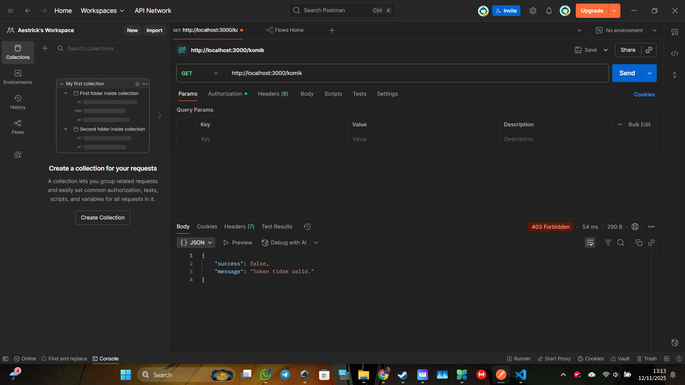
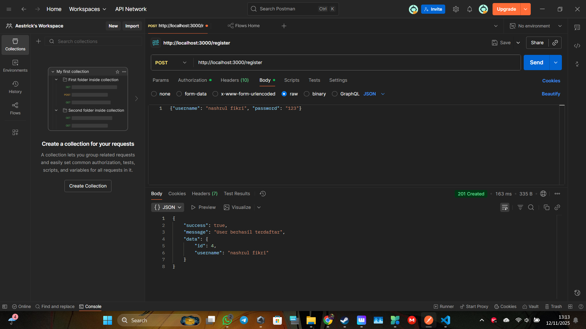
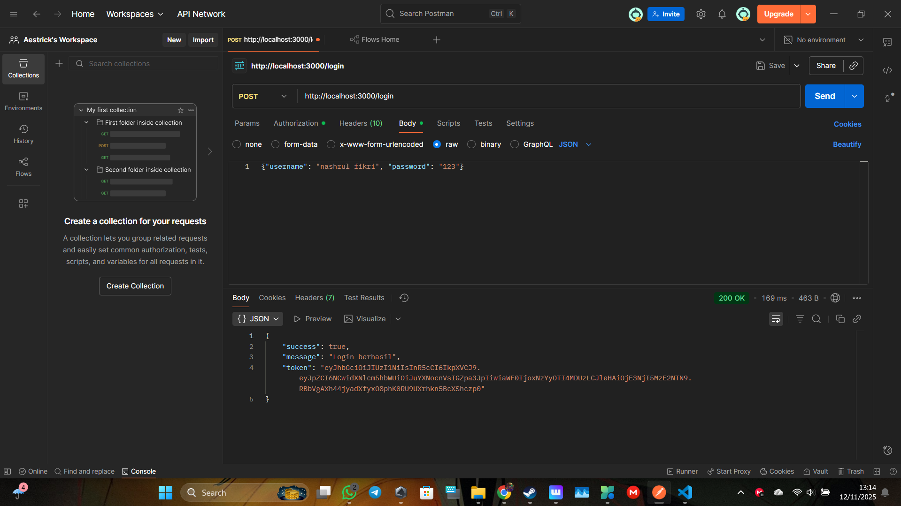
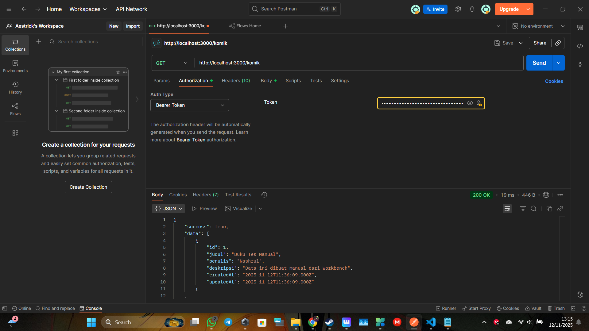
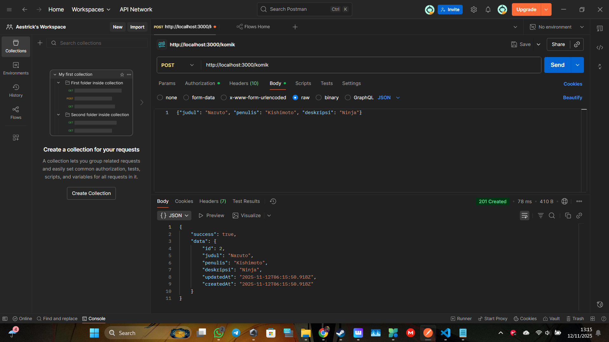
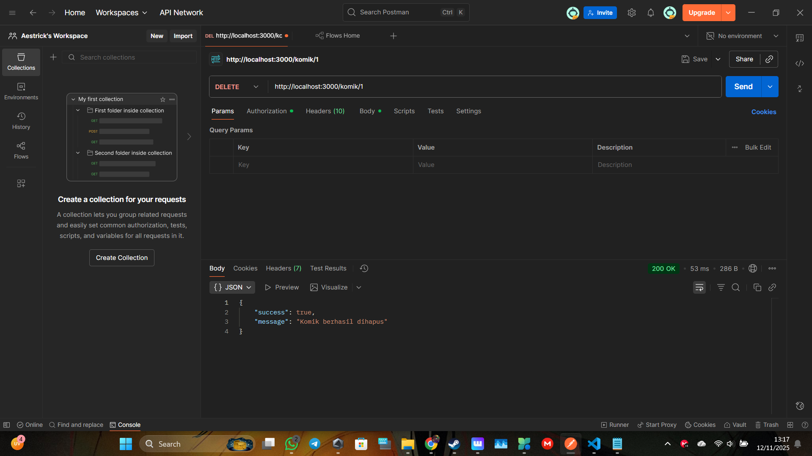

# Praktikum 5: Autentikasi & Otorisasi API (JWT)

Ini adalah proyek API CRUD (Create, Read, Update, Delete) untuk data **Komik** yang diamankan menggunakan **JSON Web Token (JWT)**.

Proyek ini dibangun dengan:
* **Express.js** sebagai server
* **Sequelize** sebagai ORM
* **MySQL** sebagai database (`praktikum5_db`)
* **bcrypt.js** untuk *hashing* password
* **jsonwebtoken** untuk membuat dan memverifikasi token

## 📖 Fitur API

### Endpoint Autentikasi (Publik)
* `POST /register`: Mendaftarkan user baru.
* `POST /login`: Mengautentikasi user dan memberikan JWT (token).

### Endpoint CRUD (Aman - Butuh Token)
* `GET /komik`: Melihat semua data komik.
* `POST /komik`: Menambahkan data komik baru.
* `PUT /komik/:id`: Mengubah data komik berdasarkan ID.
* `DELETE /komik/:id`: Menghapus data komik berdasarkan ID.

---

## 📸 Hasil Pengujian Postman

Berikut adalah alur pengujian API menggunakan Postman.

### 1. Uji Coba Gagal (Membuktikan API Aman)
Mencoba mengakses rute `/komik` tanpa mengirimkan token. Server menolak akses (`401 Unauthorized`).

### 2. Registrasi User Baru
Membuat akun baru dengan `POST /register`.

### 3. Login & Mendapatkan Token
Login dengan akun yang sudah dibuat (`POST /login`) untuk mendapatkan *Bearer Token*.

### 4. Pengujian Rute Aman (CRUD dengan Token)
Semua *request* di bawah ini dikirimkan dengan menyertakan *Bearer Token* di *header Authorization*.

#### GET /komik (Read All)
Berhasil membaca semua data komik.

#### POST /komik (Create)
Berhasil menambahkan data komik baru.

#### PUT /komik/:id (Update)
Berhasil mengubah data komik.

#### DELETE /komik/:id (Delete)
Berhasil menghapus data komik.

